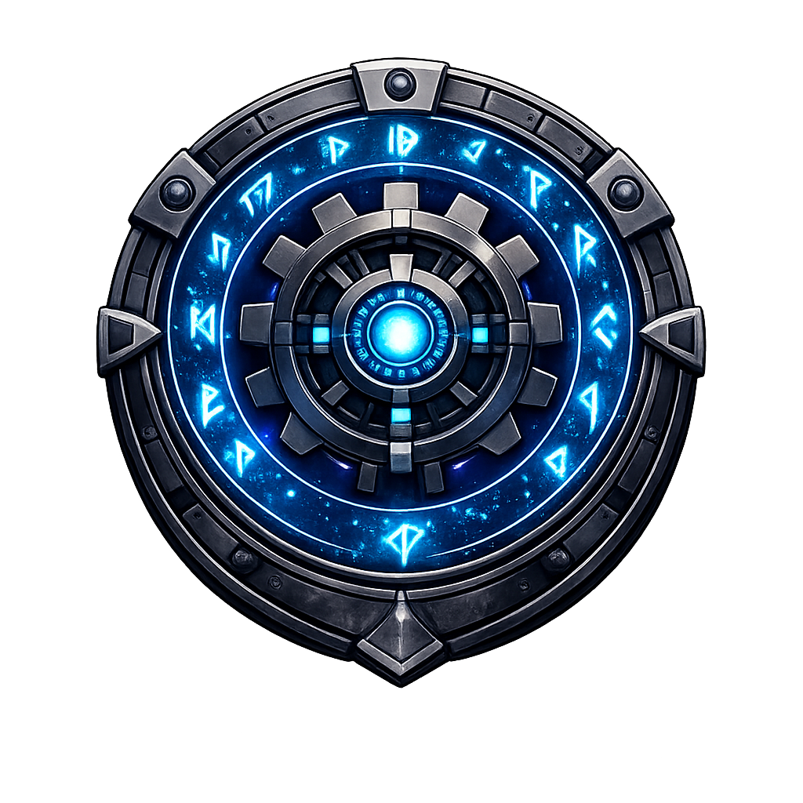

  

# RunicCraft: New Ascension

**RunicCraft: New Ascension (RCNA)** is a Minecraft **1.12.2** project focused on deep progression, survival mechanics, technology, and magical systems.

This organization hosts the development of the RCNA ecosystem, including the core codebase, development templates, and supporting repositories used for building and maintaining the project.

## Core Repository

**RCNACore**

RCNACore is the primary codebase for the project and contains:

* The TerraFirmaCraft fork used by RCNA
* Core gameplay systems and mechanics
* Shared framework code used across the project

This repository serves as the foundation for RCNA development.

## RCNA Project – Mod Repositories

These repositories contain mods that are either **developed specifically for** or **forked and modified for use in** the *RunicCraft: New Ascension* modpack.

* **RCNACore**
  TerraFirmaCraft fork and the primary RCNA framework containing core systems, gameplay logic, and shared functionality.
  It also includes integration logic for certain mod APIs (such as **Thaumcraft**) to allow their features and world content to generate properly within TerraFirmaCraft worlds.

* **RCNA GregTech Community Edition Unofficial**
  Fork of GregTech CEu used for balance adjustments and integration within the RCNA modpack.

* **More to come**

## Development

RCNA is developed for **Minecraft 1.12.2** using a modernized development environment based on the Cleanroom toolchain.

The goal of the project is to build a stable and extensible foundation for long-form progression gameplay within the Minecraft 1.12.2 modding ecosystem.

## Status

RCNA is currently under active development.
